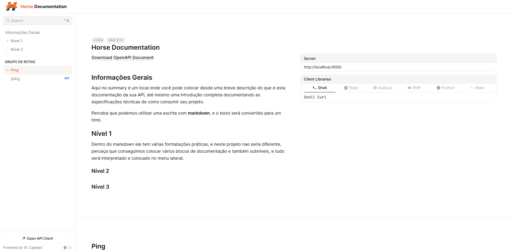

# Horse Documentation

[](LICENSE)
[](https://github.com/weslleycapelari/horse-documentation/releases)

Um poderoso middleware para o framework [Horse](https://github.com/HashLoad/horse) que gera automaticamente documentação de API interativa e elegante, utilizando o padrão **OpenAPI 3.1** e a interface de usuário **Scalar**.

## Visão Geral

O **Horse Documentation** simplifica drasticamente o processo de documentação de APIs em Delphi. Com uma única linha de código, ele inspeciona sua aplicação Horse, descobre todos os endpoints registrados e gera uma página de documentação funcional. Para documentações mais ricas e detalhadas, ele oferece uma interface fluente e poderosa que permite descrever cada aspecto da sua API, desde parâmetros e corpos de requisição até esquemas de segurança e exemplos de resposta.


*(Imagem de exemplo da interface Scalar)*

## ✨ Recursos Principais

*   🔎 **Descoberta Automática de Endpoints:** Analisa sua instância Horse em tempo de execução e mapeia todas as rotas automaticamente, sem a necessidade de anotações ou configurações manuais.
*   🖋️ **Interface Fluente (Builder):** Enriqueça sua documentação de forma programática e intuitiva, descrevendo endpoints, parâmetros, schemas, respostas, tags e muito mais.
*   📄 **Padrão OpenAPI 3.1:** Gera uma especificação `json` totalmente compatível com a versão mais recente do padrão OpenAPI, garantindo interoperabilidade com uma vasta gama de ferramentas.
*   🎨 **UI Moderna com Scalar:** Apresenta sua documentação em uma interface bonita, responsiva e interativa, que inclui um cliente de API para testar os endpoints diretamente do navegador.
*   🚀 **Integração Simples:** Adicione a documentação à sua API Horse com apenas uma linha de código.
*   🧩 **Autocontido:** Não requer dependências externas. O HTML, CSS e JavaScript da interface Scalar são servidos diretamente pelo middleware.
*   🔧 **Totalmente Customizável:** Configure as rotas da documentação e detalhe cada aspecto da sua API para atender às suas necessidades.

## 📦 Instalação

A maneira mais fácil de instalar é através do gerenciador de pacotes [Boss](https://github.com/HashLoad/boss):

```sh
boss install github.com/weslleycapelari/horse-documentation
```

Alternativamente, você pode clonar o repositório e adicionar o caminho da pasta `src` ao *Library Path* do seu projeto no Delphi.

## 🚀 Guia Rápido (Quick Start)

Para adicionar a documentação à sua API, basta usar o middleware `HorseDocumentation`. É simples assim.

```delphi
uses
  Horse,
  Horse.Documentation, // Adicione esta unit
  Horse.Jhonson;

begin
  THorse.Use(Jhonson);
  
  // Adicione o middleware de documentação
  THorse.Use(HorseDocumentation);

  THorse.Get('/ping',
    procedure(Req: THorseRequest; Res: THorseResponse; Next: TProc)
    begin
      Res.Send('pong');
    end);

  THorse.Listen(9000);
end.
```

Agora, execute seu servidor e acesse as seguintes URLs no seu navegador:

*   **Documentação Interativa:** `http://localhost:9000/horse/doc/html`
*   **Especificação OpenAPI (JSON):** `http://localhost:9000/horse/doc/json`

Você verá que o endpoint `/ping` já foi descoberto e documentado automaticamente!

## 🛠️ Uso Avançado: Enriquecendo a Documentação

A verdadeira força do `Horse-Documentation` está na sua capacidade de detalhar a API usando a interface fluente do objeto global `HorseDoc`.

O `HorseDoc` é uma implementação da interface `IOpenApi` e serve como ponto de entrada para descrever toda a sua API.

### Exemplo Completo

Vamos documentar uma API de usuários mais complexa.

```delphi
program Project1;

{$APPTYPE CONSOLE}

uses
  System.SysUtils,
  Horse,
  Horse.Documentation,
  Horse.Jhonson,
  Horse.Documentation.OpenApi.Interfaces, // Interfaces da OpenAPI
  Horse.Documentation.OpenApi.Types;      // Tipos (enums) da OpenAPI

begin
  THorse.Use(Jhonson);
  THorse.Use(HorseDocumentation);

  // 1. Descrevendo as informações gerais da API
  HorseDoc.Info
    .Title('API de Exemplo de Usuários')
    .Version('1.0.0')
    .Description('Uma API simples para gerenciar usuários.')
    .Contact
      .Name('Seu Nome')
      .Email('seu.email@exemplo.com')
      .&End; // Volta para o objeto Info

  // 2. Adicionando uma Tag para agrupar endpoints
  HorseDoc.Tags.Add
    .Name('Users')
    .Description('Operações relacionadas a usuários');

  // 3. Documentando um endpoint GET para buscar um usuário por ID
  HorseDoc.Paths.Add('/users/{id}') // Adiciona o caminho
    .Get // Define a operação como GET
      .Tags.Add('Users') // Associa a tag 'Users'
      .Summary('Obter um usuário por ID')
      .Description('Retorna os detalhes de um usuário específico com base no seu ID.')
      .Parameters.Add // Adiciona um novo parâmetro
        .Name('id')
        .&In(TParameterLocation.plPath) // Parâmetro está no path
        .Required(True)
        .Description('ID único do usuário')
        .Schema(TJSONObject.Create
          .AddPair('type', 'integer')
          .AddPair('format', 'int64'))
        .&End // Finaliza a definição do parâmetro
      .Responses // Começa a definir as respostas
        .StatusCodes.Add('200') // Resposta para o status 200 (OK)
          .Description('Usuário encontrado com sucesso')
          .Content.Add('application/json')
            .Schema(TJSONObject.Create.AddPair('$ref', '#/components/schemas/User'))
            .&End
          .&End // Finaliza a resposta 200
        .StatusCodes.Add('404')
          .Description('Usuário não encontrado')
          .&End;

  // 4. Definindo um Schema reutilizável em 'Components'
  HorseDoc.Components.Schemas.Add('User',
    TJSONObject.Create
      .AddPair('type', 'object')
      .AddPair('properties', TJSONObject.Create
          .AddPair('id', TJSONObject.Create.AddPair('type', 'integer'))
          .AddPair('name', TJSONObject.Create.AddPair('type', 'string'))
          .AddPair('email', TJSONObject.Create.AddPair('type', 'string'))
      )
  );

  // Endpoint real no Horse
  THorse.Get('/users/:id',
    procedure(Req: THorseRequest; Res: THorseResponse; Next: TProc)
    var
      LUser: TJSONObject;
    begin
      // Sua lógica de busca de usuário aqui...
      LUser := TJSONObject.Create;
      LUser.AddPair('id', StrToInt64(Req.Params['id']));
      LUser.AddPair('name', 'Usuário Exemplo');
      LUser.AddPair('email', 'usuario@exemplo.com');
      Res.Send<TJSONObject>(LUser);
    end);

  Writeln('Servidor iniciado em http://localhost:9000');
  THorse.Listen(9000);
end.

```

Após executar este código, atualize a página da documentação. Você verá o novo endpoint `/users/{id}` com todas as descrições, parâmetros e respostas que você definiu.

## ⚙️ Configuração

Você pode customizar as rotas onde a documentação e a especificação JSON são servidas, passando-as como parâmetros para a função `HorseDocumentation`:

```delphi
// A documentação ficará em /docs e o JSON em /api-spec.json
THorse.Use(HorseDocumentation('/docs', '/api-spec.json'));
```

## 🤝 Como Contribuir

Contribuições são muito bem-vindas! Se você tem uma ideia, encontrou um bug ou quer melhorar o projeto, por favor, siga estes passos:

1.  **Fork** o repositório.
2.  Crie uma nova **branch** para sua feature (`git checkout -b feature/minha-feature`).
3.  Faça o **commit** das suas alterações (`git commit -am 'Adiciona minha feature'`).
4.  Faça o **push** para a branch (`git push origin feature/minha-feature`).
5.  Abra um **Pull Request**.

Por favor, abra uma *issue* para discutir mudanças maiores antes de começar a trabalhar.

## 📄 Licença

Este projeto está licenciado sob a Licença MIT. Veja o arquivo [LICENSE](LICENSE) para mais detalhes.
